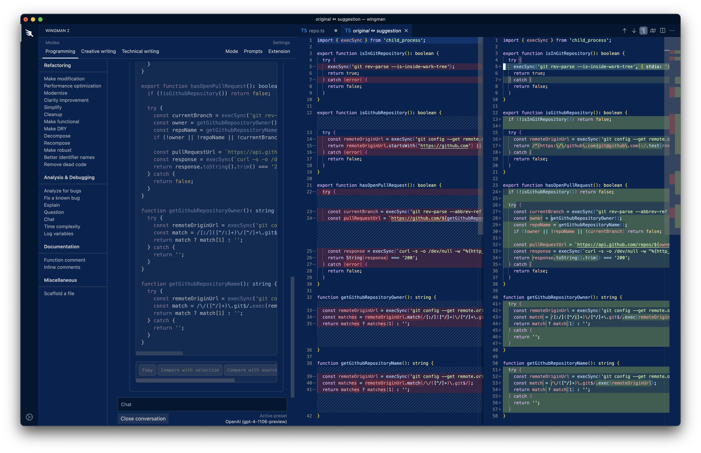
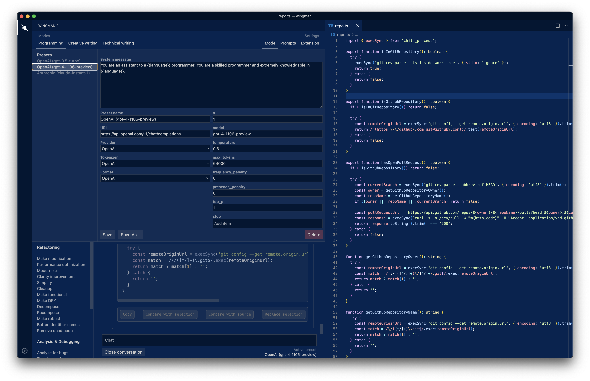
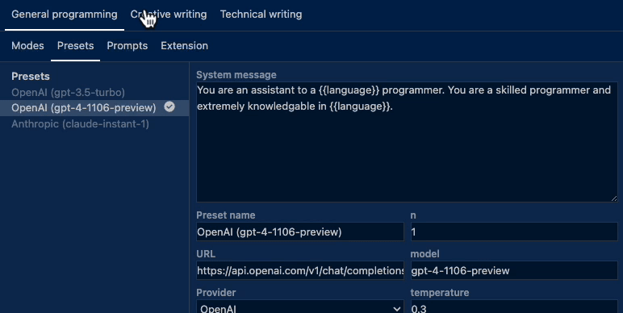

A highly flexible, customizable, and powerful extension for working with LLMs within Visual Studio Code.

Highlights:

- Compatible with OpenAI (any model), Anthropic (any model), KoboldCpp (any model) — and any API following the same request/response pattern. Do you self-host an inference server and LLM? You will love Wingman.
- Complete control over completion parameters, system message, and more.
- Highly customizable prompt templates with built-in prompt management.
- Workspace-specific chat history storage. Review old chats whenever.
- No need to edit `settings.json` for any reason. There's a UI for everything.
- A few modes, and dozens of prompts to get you started.

# Usage

First, configure API keys for whichever providers you plan to use.

Open the command pallete (Windows: <kbd>⊞</kbd><kbd>⇧</kbd><kbd>P</kbd>, macOS: <kbd>⌘</kbd><kbd>⇧</kbd><kbd>P</kbd>) and search for the command named. "Wingman: Set API key". Select the provider you want to use, enter your API key, and press enter.

# Core concepts

There are three concepts that are crucial to understanding how Wingman operates.

It's really not that complicated.

- Prompts
- Presets
- Modes

# Prompts

A UI is included for prompt management.

Wingman makes your prompts dynamic with support for dyanmic placeholders.

Supported dynamic placeholders:

- `{{selection}}` is replaced with the selected text.
- `{{ft}}` is replaced with the VSCode language identifier (`go`, `typescript`)
- `{{language}}` is replaced with a friendly language name (`Go`, `TypeScript`).
- `{{file}}` is replaced with the contents of the active file.
- `{{input}}` prompts for user input and replaces this placeholder with the response.
- `{{:param:val}}` prompt-level completion param overrides (e.g. `{{:top_k:0.1}}`).

# Presets

A UI is included for preset management.

A preset is a provider configuration. It defines the system message, the provider, the API URL for the provider, and all completion parameters for that provider. You can create as many presets as you want and switch between them whenever.

# Modes

A UI is included for preset management.

Modes enhance the prompt and preset management experience. A mode is a collection of presets and prompts. Built-in modes are "Programming", "Creative writing", and "Technical writing".

Modes can have presets assigned to them. Here's why this is useful:

- Your "Programming" mode can use your GPT-4-Turbo preset.
- Your "Creativing writing" mode can use your Anthropic Claude preset.
- And so on, and so forth.

Switching between modes automaticlaly activates the last preset used in that mode.

# Development

1. In `/webview`: `npm run dev`. This is a Svelte project that outputs to `/extension/dist`.
2. In `/extension`: `npm run build:watch`
3. Run the extension using the debug panel.

# What's next?

|                       | What?                                                       | When? |
| --------------------- | ----------------------------------------------------------- | ----- |
| Github placeholders   | `{{gh_pr_comments}}`                                        | Soon  |
|                       | `{{gh_pr_diff}}`                                            | Soon  |
| Code review           | PR review, comment generation                               | Soon  |
|                       | PR review, provide solutions driven by commentor suggestion | Soon  |
| Personalities         | Simple personality management UI.                           | Later |
|                       | `{{personality:me}}` `{{personality:sarcastic}}`            | Later |
| Import/export prompts | Export prompts to JSON                                      | Soon  |
